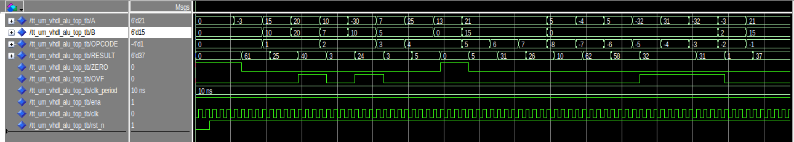

Project Title: 6-bit Signed ALU with TinyTapeout Wrapper 
Institution: FH Kärnten 
Course: Digital-1 
Program: Integrated Systems & Circuit Design

## How it works

This design is a 6-bit signed (two’s-complement) ALU with a TinyTapeout wrapper.
Core timing: Inputs (A, B, opcode) are sampled on a rising clock edge; RESULT/ZERO/OVF are registered and appear on the next rising edge (1-cycle latency).
Signed input operand range: −32…+31.  
Reset: rst_n is active-low, asynchronous. While low, the ALU holds RESULT=0, ZERO=1, OVF=0.
Enable: ena is unused in this design (wrapper passes it through; it does not gate logic).

**ALU core:** 
For each clock cycle, one of 16 operations is selected by opcode.
ZERO flag is 1 when the computed result equals 0.
OVF is a signed overflow flag (asserted for ADD/SUB/NEG/INC/DEC under two’s-complement rules). It is 0 for logic, shifts, MUL, DIV (Signed integer division, if B = 0, the result is 0 (ZERO=1, OVF=0)).

**Control truth table (opcode --> operation)**

| Opcode | Operation | Result | Notes |
|:-----:|:----------|:-------|:------|
| `0000` | PASSA | `A` | — |
| `0001` | ADD | `A + B` | `OVF` on signed overflow |
| `0010` | SUB | `A - B` | `OVF` on signed overflow |
| `0011` | MUL | `(A * B) mod 64` | truncate to 6 bits, `OVF=0` |
| `0100` | DIV | `A / B` | if `B=0` → `0`, `ZERO=1`, `OVF=0` |
| `0101` | AND | `A and B` | bitwise |
| `0110` | OR  | `A or  B` | bitwise |
| `0111` | XOR | `A xor B` | bitwise |
| `1000` | LSL1 | `A << 1` | logical left shift |
| `1001` | ASR1 | `A >> 1` | arithmetic right shift (keeps sign) |
| `1010` | NOT | `not A` | bitwise |
| `1011` | NEG | `-A` | `OVF` when `A = -32` |
| `1100` | INC | `A + 1` | `OVF` when `A = +31` (wraps to −32) |
| `1101` | DEC | `A - 1` | `OVF` when `A = -32` (wraps to +31) |
| `1110` | SLT | `1` if `A < B` else `0` | signed compare |
| `1111` | XNOR | `not (A xor B)` | bitwise |

Mapping of ports:
Input port: ui_in[5:0]=A, 
            ui_in[7:6]=opcode[1:0], 

Bidirectional port : uio_in[7:2]=B, 
                     uio_in[1:0]=opcode[3:2] 

Output port : uo_out[7:2]=RES[5:0] 
              uo_out[0]=OVF, uo_out[1]=ZERO 

## How to test
I have tested the design using the Modelsim and these are the results i am able to see.

|  #  | Op    | Opcode (dec) |  A  |  B  | Expected RESULT | ZERO | OVF |
| :-: | :---- | :----------: | :-: | :-: | :-------------: | :--: | :-: |
|  1  | PASSA |       0      |  -3 |  0  |        -3       |   0  |  0  |
|  2  | ADD   |       1      |  15 |  10 |        25       |   0  |  0  |
|  3  | ADD   |       1      |  20 |  20 |       -24       |   0  |  1  |
|  4  | SUB   |       2      |  10 |  7  |        3        |   0  |  0  |
|  5  | SUB   |       2      | -30 |  10 |        24       |   0  |  1  |
|  6  | MUL   |       3      |  7  |  5  |       -29       |   0  |  0  |
|  7  | DIV   |       4      |  25 |  5  |        5        |   0  |  0  |
|  8  | DIV   |       4      |  13 |  0  |        0        |   1  |  0  |
|  9  | AND   |       5      |  21 |  15 |        5        |   0  |  0  |
|  10 | OR    |       6      |  21 |  15 |        31       |   0  |  0  |
|  11 | XOR   |       7      |  21 |  15 |        26       |   0  |  0  |
|  12 | LSL1  |       8      |  5  |  0  |        10       |   0  |  0  |
|  13 | ASR1  |       9      |  -4 |  0  |        -2       |   0  |  0  |
|  14 | NOT   |      10      |  5  |  0  |        -6       |   0  |  0  |
|  15 | NEG   |      11      | -32 |  0  |       -32       |   0  |  1  |
|  16 | INC   |      12      |  31 |  0  |       -32       |   0  |  1  |
|  17 | DEC   |      13      | -32 |  0  |        31       |   0  |  1  |
|  18 | SLT   |      14      |  -3 |  2  |        1        |   0  |  0  |
|  19 | XNOR  |      15      |  21 |  15 |       -27       |   0  |  0  |

## External hardware

3.3 V logic clock source or a microcontroller to drive clk. 
Reset button for rst_n (active-low) 

Inputs as switches (16 total) 
2× 8-switch DIP blocks work nicely: 
UI bank → ui[5:0] = A[5:0], ui[7:6] = opcode[1:0] 
UIO bank → uio[7:2] = B[5:0], uio[1:0] = opcode[3:2] 

Outputs as LEDs (8 total) 
uo[7:2] → RESULT[5:0], uo[1] → ZERO, uo[0] → OVF 

One LED per pin with ~330 Ω series resistors to 3.3 V (or to GND, depending on wiring). 
